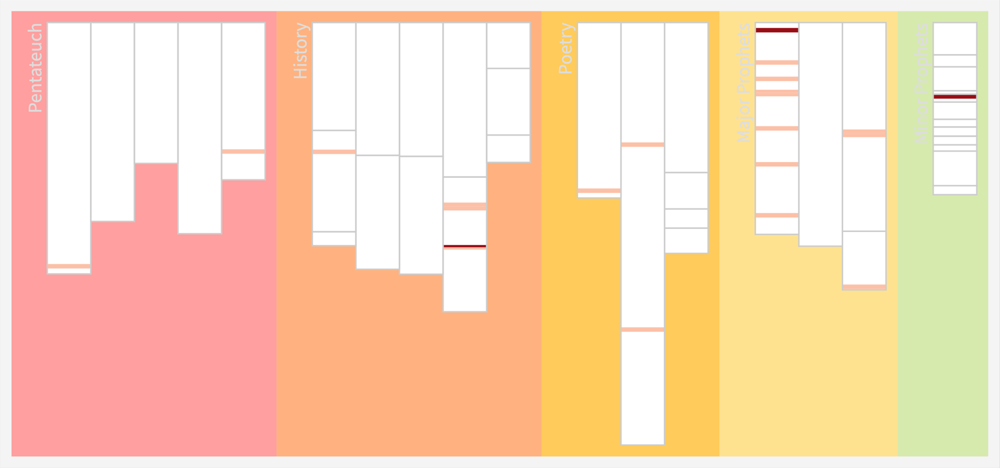

W ostatnim artykule przedstawiłem fragmeny, które zawierały słowa takie jak "łódź" oraz "Piotr".
Te fragmenty są dobrze znane, ale ciekawe jest, że zostały pominięte fragmenty z Ewangelii św. Jana i św. Marka, które także mówiły o tym wydarzeniu.
Zostały one pominięte, bo nie został tam wyróżniony św. Piotr.

W tym wpisie przedstawię jak odpowiedzieć na pytanie, które fragmenty w Biblii używają jakiegoś słowa, jak brzmi ono w oryginale i jak zostało przetłumaczone w Biblii.
Biblia została napisana w języku greckim i hebrajskim, dlatego pewna podstawowa znajomość tych języków jest przydatna przy tym wyszukiwaniu.

## Po co?

Takie wyszukiwanie słów w Biblii jest bardzo ważne, nie tylko dla egzegetów, ale dla każdego wiernego. W dziedzinie kierowania Kościołem możliwość sprawdzenia wszystkich wystąpień danego słowa pozwala na samodzielną interpretację.

Po pierwsze, umożliwia to pogłębione zrozumienie pewnych tematów w Biblii. Na przykład, jeśli chce się poznać, co Biblia mówi o miłości nieprzyjaciół, można porównać Pięcioksiąg, Księgi Historyczne oraz Nowy Testament i zobaczyć, jak ewoluowało rozumienie tej miłości.

Po drugie, takie wyszukiwanie umożliwia analizę kontekstualną. Wierzymy, że Biblia jest Pismem Świętym natchnionym przez Boga, a każde słowo ma znaczenie zamierzone przez Niego, które trzeba odkryć. Mimo że różne księgi były pisane przez różnych autorów, mają jednego boskiego Autora — Ducha Świętego. Dlatego można powiedzieć, że Biblia tłumaczy się sama. 

W praktyce oznacza to, że jeśli na przykład w Apokalipsie znajduje się słowo "lampa" i trudno zrozumieć z kontekstu, co ono oznacza, można sprawdzić, gdzie w innym miejscu tej księgi zostało użyte to słowo. Następnie można poszukać, gdzie w Nowym Testamencie lub całej Biblii występuje to słowo. Każde wystąpienie tego słowa zawiera inny kontekst, który pozwala poznać nowe aspekty w jego rozumieniu. Na przykład słowo "wiara" może pojawiać się w różnych kontekstach, w jednym oznaczając postawę — zaufanie, a w innym zestaw przekonań dotyczących budowy i powstania wszechświata.

Po trzecie, dla osób tłumaczących Biblię taka analiza pozwala odpowiednio dobrać słowo, które należy wykorzystać w tłumaczeniu. Z drugiej strony, osobom czytającym Biblię umożliwia sprawdzenie, czy "nowe tłumaczenie Biblii" jest uzasadnione. Na przykład, czy w Biblii mowa jest o pannach głupich, czy nieroztropnych.

<!-- ::: {.column-margin} -->

<!-- ::: -->

Z punktu widzenia kierowania Kościołem jest to także bardzo ważne. Wiara opiera się na Piśmie Świętym i Tradycji, więc manipulując tłumaczeniem, można wpływać na treść wiary i postawy ludzi. Posiadanie narzędzi i procedur badania tekstu oryginalnego pozwala w sposób rzeczowy dochodzić do sensu oryginalnego. Jest to także doskonałe ćwiczenie w poszukiwaniu i weryfikacji informacji w oparciu o źródła, co chroni przed manipulacją.

Zwłaszcza dzisiaj, gdy przestrzeń publiczna jest zalewana przez generowane przez sztuczną inteligencję treści i często bardzo trudno rozróżnić rzeczywistość od fikcji, umiejętność sprawdzania inforacji jest nieoceniona.

## Opis wideo

Poniżej zamieściłem nagranie pokazujące jak można w przykładowym programie bibiljnym sprawidzić wystąpienia słowa "łódź" w Biblii.



Najpierw zostaje wyszukane słowo "łódź". (59 wystąpień)
Następnie sprawdzone zostaje jak to słowo brzmi w oryginale (πλοῖον) oraz jak to słowo zostało przetłumaczone w różnych miejscach w Biblii.

Wyszukując fragmentów które zawierają słowo "łódź LUB statek" otrzymuje się już 131 rezultatów. 
Następnie można spojrzeć na przygotowane zestawienia opisujące statki i łodzie w Biblii, który zawiera wszystkie słowa greckie i hebrajskie użyte do określenia statków i łodzi oraz słowa, które użyto przy ich tłumaczeniu, w tym fragmenty, w których zostało ono wywnioskowane na podstawie zastosowanego czasowonika. 

Istnieje możliwość wygenerowani i prezentacji wszystkich wystąpień słowa "πλοῖον" w formie graficznej. 

W ostatnim fragmencie w wyszukiwaniu dodaje się dodatkowe kryteria: wyszukaj fragmentów tylko w Ewangeliach i miejsca, gdzie jest wymieniony Piotr.
W efekcie otrzymuje się trzy fragmenty, które zotały przedstawione w [poprzednim](/articles/2025-08-06-Jezus-ratuje-Piotra/index.qmd) wpisie.

::: {.article-btn}
[więcej](/articles/index.qmd)
:::

::: grid
::: {.g-col-12 .g-col-md-6}

O autorze
: [Ks. Tomasz Włodarczyk](../../about.qmd) 

<!-- Copyright and licence -->
: &copy; 2025 Ks. Tomasz Włodarczyk

: Obraz Akadamia Platona, Mozaika rzymska z 1 w. p. Chr., Museo Nazionale Archeologico, Neapol.
:::
::: {.g-col-12 .g-col-md-6}

:::
:::